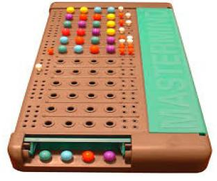
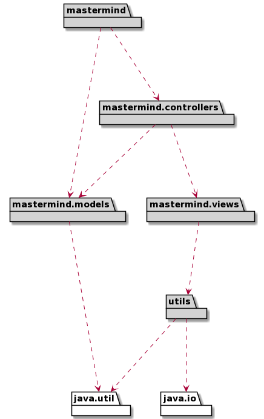
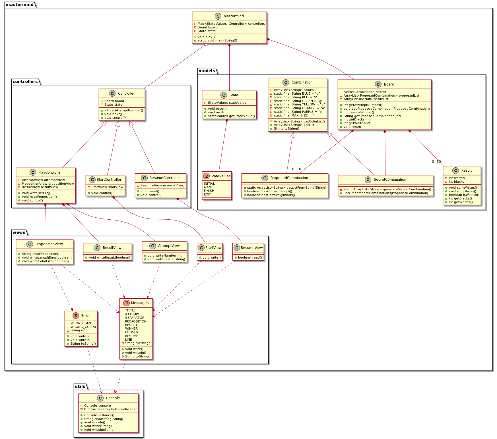

<!DOCTYPE html>
<html lang="en">
<head>
  <meta charset="UTF-8">
  <meta http-equiv="X-UA-Compatible" content="IE=edge">
  <meta name="viewport" content="width=device-width, initial-scale=1.0">
  <meta name="author" content="Ana González Santamaría">
  <link rel="stylesheet" href="https://fonts.googleapis.com/css?          family=Open+Sans:300,300italic,400,400italic,600,600italic%7CNoto+Serif:400,400italic,700,700italic%7CDroid+Sans+Mono:400,700">
  <link rel="stylesheet" href="https://cdnjs.cloudflare.com/ajax/libs/font-awesome/4.7.0/css/font-awesome.min.css">
</head>
<body>
  <h1>Mastermind. Solución 4. modelViewPresenter con vista pasiva</h1>
  

    Ana González Santamaría 
    <a href="mailto:ana97gs@gmail.com">ana97gs@gmail.com</a> 
    version 0.0.1
  

  

    
Índice

      <ul class="sectlevel1">
        <li><a href="#requisitos-1-básica">Requisitos 1. Básica</a></li>
        <li><a href="#vista-de-lógicadiseño">Vista de Lógica/Diseño</a>
          <ul class="sectlevel2">
            <li><a href="#arquitectura">Arquitectura</a></li>
            <li><a href="#clases-mastermind">Clases</em></a></li>
          </ul>
        </li>
      </ul>
    

  

  

    

      <h2 id="requisitos-1-básica">Requisitos 1. Básica</h2>
      

        <table class="tableblock frame-all grid-all stretch">
          <colgroup>
            <col style="width: 50%;">
            <col style="width: 50%;">
          </colgroup>
          <tbody>
            <tr>     
              <td class="tableblock halign-left valign-top">

                <ul>
                  <li>
                    
<a href="https://en.wikipedia.org/wiki/Mastermind_(board_game)"><strong>Wiki</strong></a> - <a href="https://www.youtube.com/watch?v=2-hTeg2M6GQ"><strong>Youtube</strong></a>

                    

                      <ul>
                        <li>
<em>Funcionalidad: <strong>Básica</strong></em>
</li>
                        <li>
<em>Interfaz: <strong>Texto</strong></em>
</li>
                        <li>
<em>Distribución: <strong>Stand Alone</strong></em>
</li>
                        <li>
<em>Persistencia: <strong>No</strong></em>
</li>
                      </ul>
                    
 
                  </li>
                </ul>
              </td>
              <td class="tableblock halign-left valign-top">

                

                  
                

              </td>
            </tr>
          </tbody>
        </table>
      

    

    

      <h2 id="vista-de-lógicadiseño">Vista de Lógica/Diseño</h2>
      

        

          <h3 id="arquitectura">Arquitectura</h3>
          

            

              
            

          

        

        

          <h3 id="clases-mastermind">Clases</h3>
          

            

              
            

          

        

      

  

</body>
</html>
