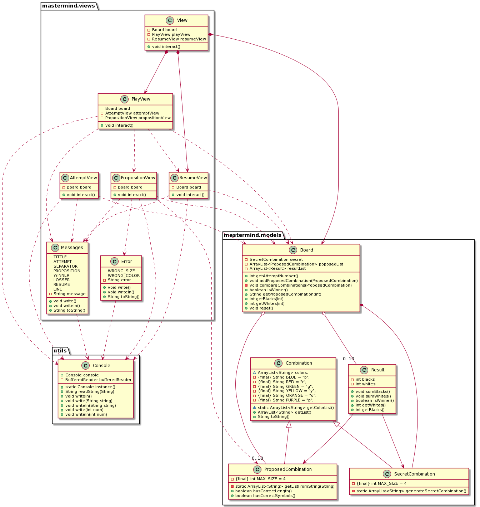
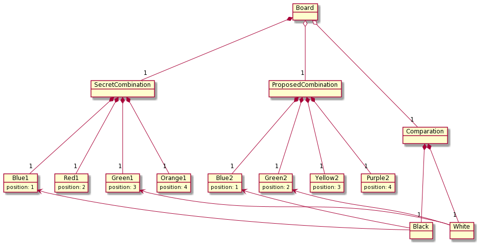
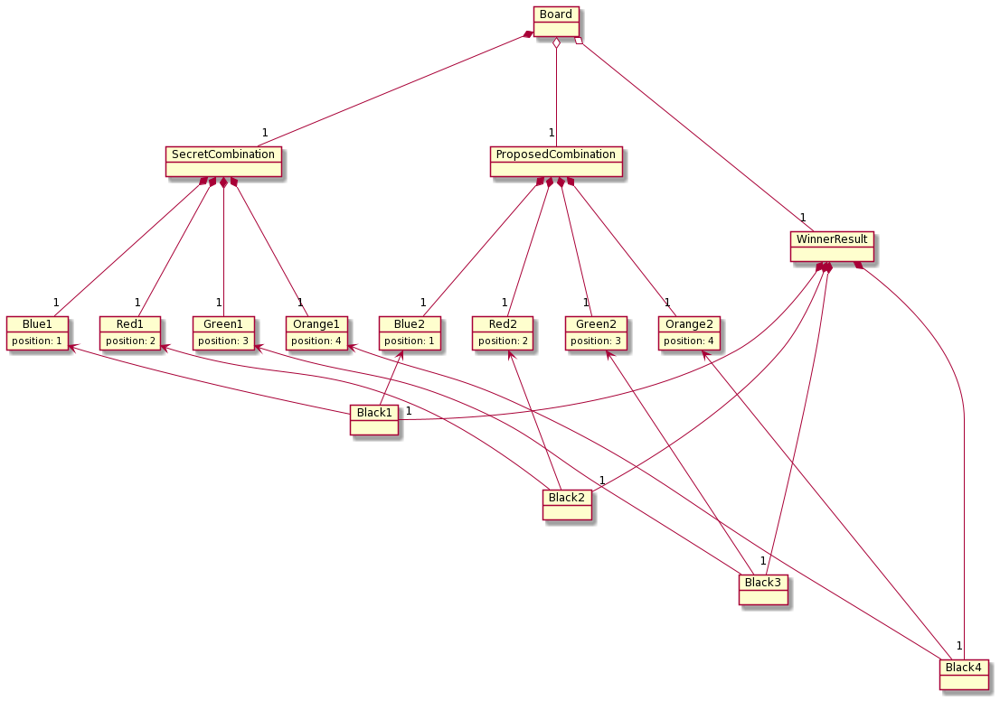
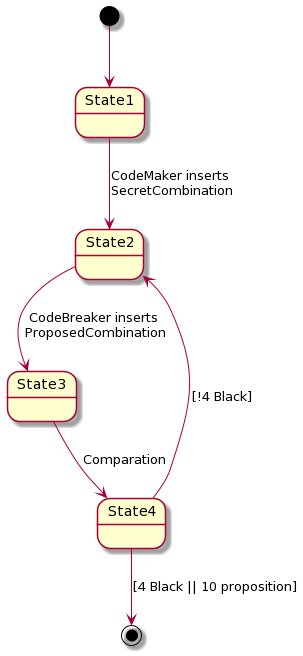

<!DOCTYPE html>
<html lang="en">
<head>
  <meta charset="UTF-8">
  <meta http-equiv="X-UA-Compatible" content="IE=edge">
  <meta name="viewport" content="width=device-width, initial-scale=1.0">
  <meta name="author" content="Ana González Santamaría">
  <link rel="stylesheet" href="https://fonts.googleapis.com/css?          family=Open+Sans:300,300italic,400,400italic,600,600italic%7CNoto+Serif:400,400italic,700,700italic%7CDroid+Sans+Mono:400,700">
  <link rel="stylesheet" href="https://cdnjs.cloudflare.com/ajax/libs/font-awesome/4.7.0/css/font-awesome.min.css">
</head>
<body>
  <h1>Mastermind</h1>
  

    Ana González Santamaría 
    <a href="mailto:ana97gs@gmail.com">ana97gs@gmail.com</a> 
    version 0.0.1
  

  

    
Table of Contents

      <ul class="sectlevel1">
        <li><a href="#modelo-del-dominio">Modelo del Dominio</a>
          <ul class="sectlevel2">
            <li><a href="#vocabulario">Vocabulario</a></li>
            <li><a href="#estado-inicial">Estado Inicial. Primera propuesta de la combinación.</a></li>
            <li><a href="#estado-final">Estado Final. Inserción de combinación correcta.</a></li>
            <li><a href="#instrucciones">Instrucciones</a></li>
          </ul>
        </li>
      </ul>
    

  

  

    

      <h2 id="modelo-del-dominio">Modelo del Dominio</h2>
      

        

          

            
          

        

        

          <h3 id="vocabulario">Vocabulario</h3>
          

            

              
            

          

        

        

          <h3 id="estado-inicial">Estado Inicial. Primera propuesta de la combinación.</h3>
          

            

              
            

          

        

        

          <h3 id="estado-final">Estado Final. Insertar combinación correcta.</h3>
          

            

              
            

          

        

        

          <h3 id="instrucciones">Instrucciones</h3>
          

            

              
            

          

        

      

  

</body>
</html>
